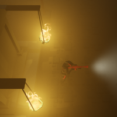

# CryENGINE Graveyard Game

## Description
This is a small ~~game~~ made in CryENGINE, to learn the basics of the engine and how to use it (basic physics, collision, AI movement and similar).

Due to the engine being very difficult to use without adding [GameSDK](https://www.cryengine.com/marketplace/product/CRYENGINE%20GameSDK%20Sample%20Project#) stuff, because the lack of examples, currently it's more a **demo level** built on the TopDown C++ Template. The initial idea was to add swarms of small enemies to kill.

I will keep this level here for now, in case someone wants to take it to give the engine a try, or for future use when the engine is improved or i want to test something else in a pre-made level. It's also useful to link the project to report engine problems to Crytek.

## Level GIF movement
To have an idea of what the level athmosphere looks like there are two small gifs you can check:
* [Not compressed GIF (~15Mb to load)](readme_images/big_gif.gif);
* [Compressed GIF (~4Mb to load)](readme_images/compressed_gif.gif).

## Engine Version
The project currently use the CryENGINE official 5.6.5 version (Build 30).

## Built using
The graveyard assets are from [Kenney Graveyard Kit](https://kenney.nl/assets/graveyard-kit)

## Special thanks
Special thanks to all the people in the [CryENGINE Discord](https://discordapp.com/invite/cryengine) for their help, Crytek developers help on Discord too!
